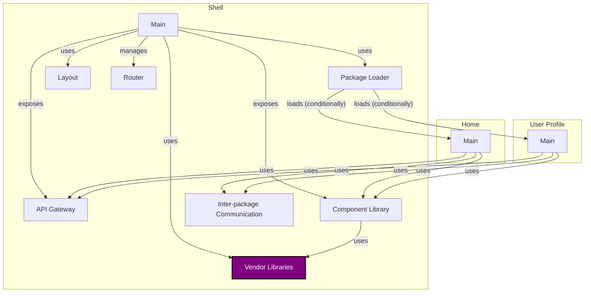

# react-single-package

## High-level relationships

```mermaid
flowchart TD

  classDef vendorLibraries stroke:#000,stroke-width:2px,fill:purple,color:#fff;

  subgraph SHELL["Shell"]
    SHELL__MAIN["Main"]
    SHELL__VENDOR_LIBRARIES["Vendor Libraries"]:::vendorLibraries
    SHELL__PACKAGE_LOADER["Package Loader"]
    SHELL__API_GATEWAY["API Gateway"]
    SHELL__COMPONENT_LIBRARY["Component Library"]
    SHELL__LAYOUT["Layout"]
    SHELL__ROUTER["Router"]
    SHELL__INTER_PACKAGE_COMMUNICATION["Inter-package Communication"]
  end

  subgraph HOME["Home"]
    HOME__MAIN["Main"]
  end

  subgraph USER_PROFILE["User Profile"]
    USER_PROFILE__MAIN["Main"]
  end

  SHELL__MAIN -- uses --> SHELL__VENDOR_LIBRARIES
  SHELL__MAIN -- uses --> SHELL__PACKAGE_LOADER
  SHELL__MAIN -- exposes --> SHELL__COMPONENT_LIBRARY
  SHELL__MAIN -- exposes --> SHELL__API_GATEWAY
  SHELL__MAIN -- uses --> SHELL__LAYOUT
  SHELL__MAIN -- manages --> SHELL__ROUTER
  SHELL__PACKAGE_LOADER -- loads (conditionally) --> HOME__MAIN
  SHELL__PACKAGE_LOADER -- loads (conditionally) --> USER_PROFILE__MAIN
  SHELL__COMPONENT_LIBRARY -- uses --> SHELL__VENDOR_LIBRARIES

  HOME__MAIN -- uses --> SHELL__COMPONENT_LIBRARY
  HOME__MAIN -- uses --> SHELL__API_GATEWAY
  HOME__MAIN -- uses --> SHELL__INTER_PACKAGE_COMMUNICATION

  USER_PROFILE__MAIN -- uses --> SHELL__COMPONENT_LIBRARY
  USER_PROFILE__MAIN -- uses --> SHELL__API_GATEWAY
  USER_PROFILE__MAIN -- uses --> SHELL__INTER_PACKAGE_COMMUNICATION

```
